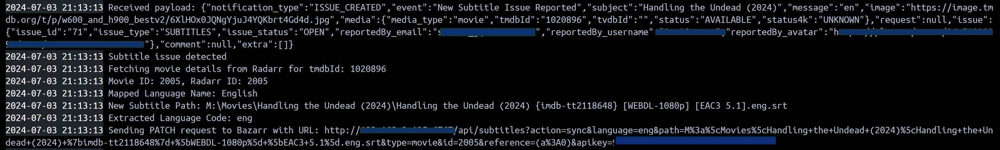

# Overr-Syncerr

Overr-Syncerr is a script designed to automate the management of subtitle synchronization issues across your media library. By leveraging **[Overseerr](https://overseerr.dev)**'s built-in webhook and issue reporting functionality, this script allows users to specify the subtitles they need synchronized. It seamlessly integrates with your existing services such as **[Sonarr](https://sonarr.tv/)**, **[Radarr](https://radarr.video/)**, and **[Bazarr](https://www.bazarr.media)**, making the entire process of subtitle synchronization more automated.

<p align="center" >
  <a href="https://github.com/gssariev/overr-syncerr/releases"></a>
  <picture></picture>
  <picture></picture>
  <a href="https://hub.docker.com/r/gsariev/overr-syncerr"></a>
  <picture></picture>
  <picture></picture>
  <picture></picture>
</p>


## Current Features

- **Full Sonarr and Radarr Integration**: Easily fetch series and movie details from Sonarr and Radarr.
- **Bazarr Integration**: Synchronize subtitles using Bazarr, including support for 4K instances and HI subtitles.
- **Language Mapping**: Map keywords to language names based on webhook messages.
- **Audio Sync**: Uses the first audio track to sync subtitles.
- **Auto-reply & resolve issue**: Automatically reply to the reported subtitle issue in Overseerr upon subtitles synchronization and mark it as resolved.
- **Sync all episodes in season**: Submit all subtitles in a specific language to be synced by selecting 'All Episodes' when submitting the subtitle issue in Overseerr.

## Future plans

- **Improve the handling of multiple Payloads** - implemented ✅

## Known issues (WIP)

- ~~**Empty Bazarr response in console log**: This is more of a visual bug when Bazarr is done synchronizing the subtitle and does **NOT** prevent the script from working.~~
- ~~**Handling Multiple Payloads** - in a case where multiple payloads are sent while one is already being processed, the rest could fail. Looking into a way to resolve this~~

## Getting Started

These instructions will help you set up and run Overr-Syncerr on your local machine.

### Prerequisites

- Docker installed on your machine.
- Docker Compose installed on your machine.

### Installation

1. **Pull the Docker image:**
   ```sh
   docker pull gsariev/overr-syncerr:latest
2. **Clone the repository:**
   ```sh
   git clone https://github.com/gssariev/overr-syncerr.git
   cd overr-syncerr
3. **Edit docker-compose.yml:**
   Open the docker-compose.yml file and replace the placeholders with your actual API keys, URLs, Ports and map keywords to the subtitle languages you use in Bazarr (look at the example structure in the docker-compose)
4. **Run the Docker container using Docker Compose:**
   Use Docker Compose to build and run the container.
   ```sh
   docker-compose up --build

The container listens for webhooks on the port you've specified. Ensure Overseerr is configured to send webhook requests to the following endpoint: **http://your-ip-address:your-port/**

### Overseerr Webhook

In your Overseerr instance go to:

1. Settings -> Notificaitons -> Webhook
2. Enable the webhook agent and paste the endpoint **http://your-ip-address:your-port/** into the Webhook URL field
3. Make sure 'Issue Reported' is ticked
4. Test to see if the webhook notificaiton is sent
5. Save Changes

### Usage

1. In Overserr, navigate to the media that has unsynced subtitles
2. Report a subtitle issue
3. Mention the langauge of the subtitles (using the specific pre-mapped keywords), if the media is 4K and if the subtitles are HI or not, and if the media needs to be synced (using the specific pre-mapped sync keywords)
4. Bazarr will start syncing the subtitles to the first audio track
5. Upon completion, Overseerr will reply to the created subtitle issue and mark it as resolved

## Preview

### Movies


### Series/Anime


### Script Log


## Found a bug?

If you found an issue or have ideas for improving this project, please submit an issue using the issue tab above.


## License
This project is licensed under the MIT License - see the LICENSE file for details.
   


